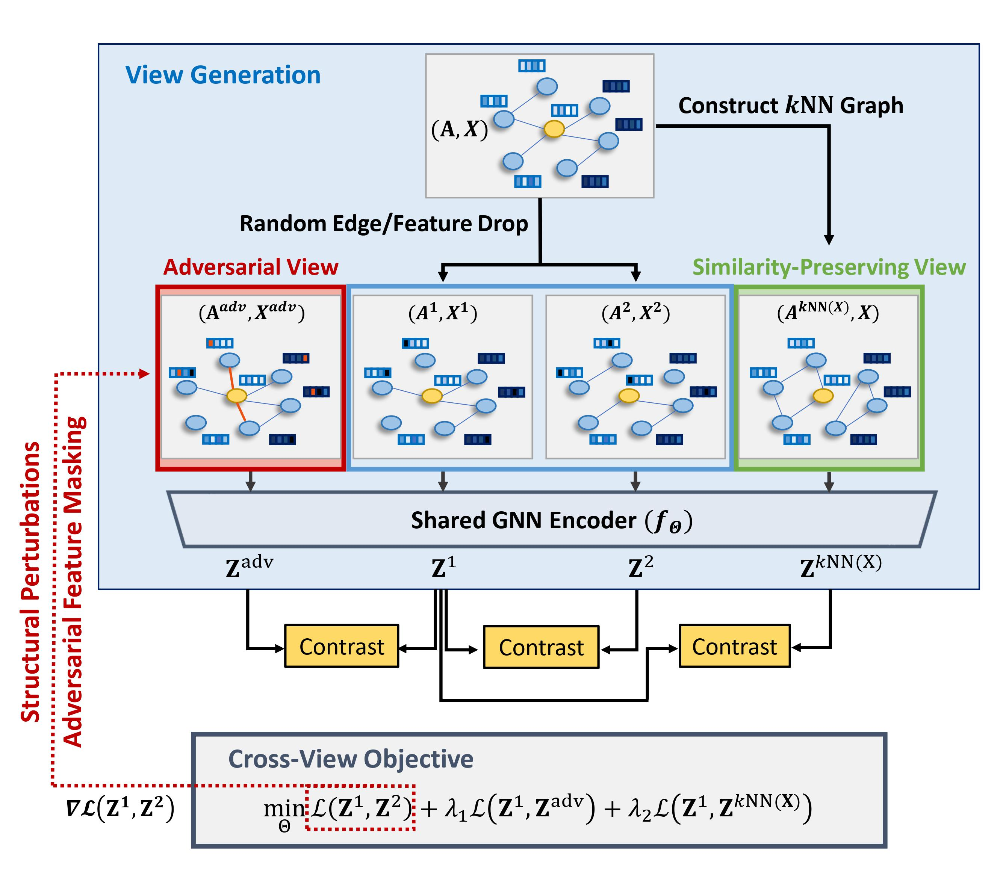

# Similarity-Preserving Adversarial Graph Contrastive Learning (SP-AGCL)

<p align="center">   
    <a href="https://pytorch.org/" alt="PyTorch">
      </a>
    <a href="https://kdd.org/kdd2023/" alt="Conference">
        </a>
    
</p>

The official source code for [**Similarity-Preserving Adversarial Graph Contrastive Learning**]() at KDD 2023. 

Yeonjun In*, [Kanghoon Yoon*](https://kanghoonyoon.github.io/), and [Chanyoung Park](http://dsail.kaist.ac.kr/professor/)

## Abstract
Adversarial attacks on a graph refer to imperceptible perturbations on the graph structure and node features, and it is well known that GNN models are vulnerable to such attacks. Among various GNN models, graph contrastive learning (GCL) based methods specifically suffer from adversarial attacks due to their inherent design that highly depends on the self-supervision signals derived from the original graph, which however already contains noise when the graph is attacked. Existing adversarial GCL methods adopt the adversarial training (AT) to the GCL framework to address adversarial attacks on graphs. By considering the attacked graph as an augmentation under the GCL framework, they achieve the adversarial robustness against graph structural attacks. However, we find that existing adversarially trained GCL methods achieve robustness at the expense of not being able to preserve the node similarity in terms of the node features, which is an unexpected consequence of applying AT to GCL models. In this paper, we propose a similarity-preserving adversarial graph contrastive learning (SP-AGCL) framework that contrasts the clean graph with two auxiliary views of different properties (i.e., the node similarity-preserving view and the adversarial view). Extensive experiments demonstrate that SP-AGCL achieves a competitive performance on several downstream tasks, and shows its effectiveness in various scenarios, e.g., a network with adversarial attacks, noisy labels, and heterophilous neighbors.

## Overall Archicteture




### Requirements
* Python version: 3.7.11
* Pytorch version: 1.10.2
* torch-geometric version: 2.0.3
* deeprobust

### How to Run
* To run node classification (reproduce Table 1 in paper, Table 2 and 3 in appendix)

```
sh sh/node.sh
```
* To run link prediction (reproduce Figure 3(b) in paper)

```
sh sh/link.sh
```
* To run node clustering (reproduce Figure 3(c) in paper)
    * You should run node classification before node clustering since we use the embeddings learned in node classification.

```
sh sh/save_emb.sh # save node embedding from the best model of node classification
sh sh/clustering.sh 
```
* To run node classification on heterophilious network (reproduce Table 2 in paper)

```
sh sh/hetero_node.sh
```

### Cite (Bibtex)
- If you find ``SP-AGCL`` useful in your research, please cite the following paper:
  - Yeonjun In, Kanghoon Yoon, and Chanyoung Park. "Similarity Preserving Adversarial Graph Contrastive Learning." KDD 2023.
  - Bibtex
```
@article{in2023similarity,
  title={Similarity Preserving Adversarial Graph Contrastive Learning},
  author={In, Yeonjun and Yoon, Kanghoon and Park, Chanyoung},
  journal={arXiv preprint arXiv:2306.13854},
  year={2023}
}
```

